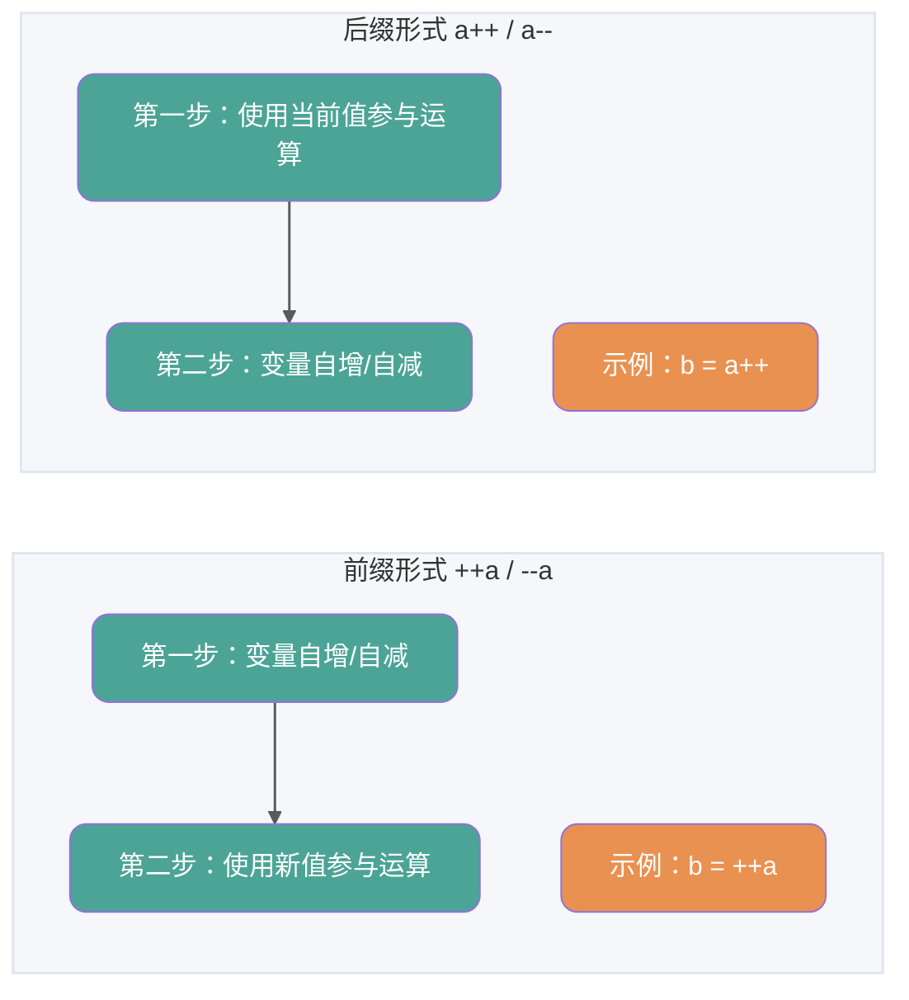
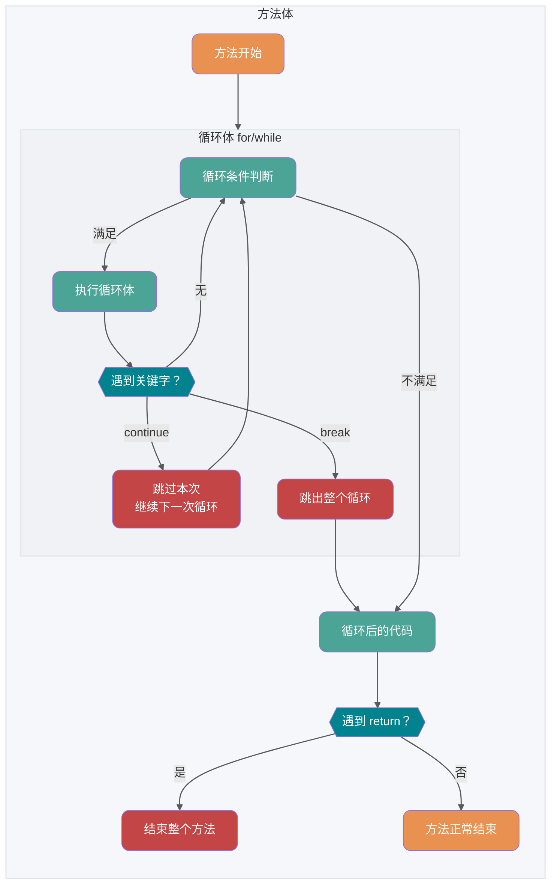
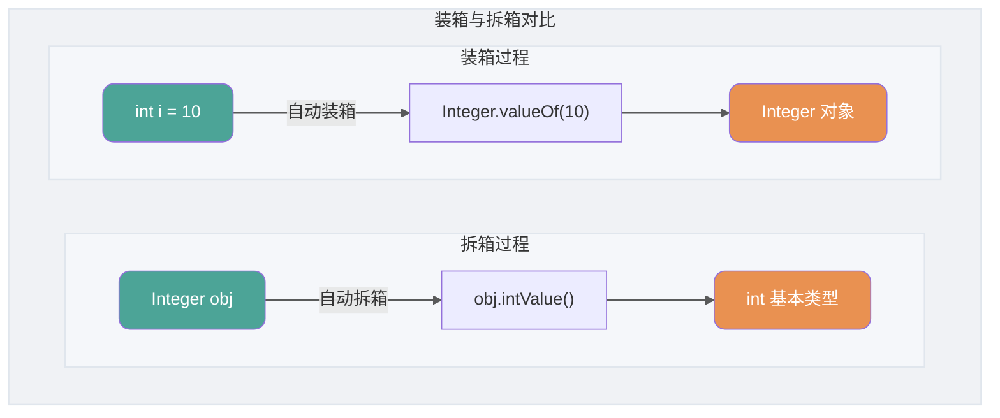

## 基础概念与常识

---

### Java SE vs Java EE
?
?
- Java SE（Java Platform, Standard Edition）: Java 平台标准版，Java 编程语言的基础，它包含了支持 Java 应用程序开发和运行的核心类库以及虚拟机等核心组件。Java SE 可以用于构建桌面应用程序或简单的服务器应用程序。
- Java EE（Java Platform, Enterprise Edition）：Java 平台企业版，建立在 Java SE 的基础上，包含了支持企业级应用程序开发和部署的标准和规范（比如 Servlet、JSP、EJB、JDBC、JPA、JTA、JavaMail、JMS）。 Java EE 可以用于构建分布式、可移植、健壮、可伸缩和安全的服务端 Java 应用程序，例如 Web 应用程序。

简单来说，Java SE 是 Java 的基础版本，Java EE 是 Java 的高级版本。Java SE 更适合开发桌面应用程序或简单的服务器应用程序，Java EE 更适合开发复杂的企业级应用程序或 Web 应用程序。

除了 Java SE 和 Java EE，还有一个 Java ME（Java Platform，Micro Edition）。Java ME 是 Java 的微型版本，主要用于开发嵌入式消费电子设备的应用程序，例如手机、PDA、机顶盒、冰箱、空调等。Java ME 无需重点关注，知道有这个东西就好了，现在已经用不上了。

---

### JVM
?
?
Java 虚拟机（Java Virtual Machine, JVM）是运行 Java 字节码的虚拟机。JVM 有针对不同系统的特定实现（Windows，Linux，macOS），目的是使用相同的字节码，它们都会给出相同的结果。字节码和不同系统的 JVM 实现是 Java 语言“一次编译，随处可以运行”的关键所在。

如下图所示，不同编程语言（Java、Groovy、Kotlin、JRuby、Clojure ...）通过各自的编译器编译成 `.class` 文件，并最终通过 JVM 在不同平台（Windows、Mac、Linux）上运行。


**JVM 并不是只有一种！只要满足 JVM 规范，每个公司、组织或者个人都可以开发自己的专属 JVM。** 也就是说我们平时接触到的 HotSpot VM 仅仅是是 JVM 规范的一种实现而已。

除了我们平时最常用的 HotSpot VM 外，还有 J9 VM、Zing VM、JRockit VM 等 JVM。维基百科上就有常见 JVM 的对比：[Comparison of Java virtual machines](https://en.wikipedia.org/wiki/Comparison_of_Java_virtual_machines)，感兴趣的可以去看看。并且，你可以在 [Java SE Specifications](https://docs.oracle.com/javase/specs/index.html) 上找到各个版本的 JDK 对应的 JVM 规范。


#

---

### ⭐️ 什么是字节码？采用字节码的好处是什么？
?
?
在 Java 中，JVM 可以理解的代码就叫做字节码（即扩展名为 `.class` 的文件），它不面向任何特定的处理器，只面向虚拟机。Java 语言通过字节码的方式，在一定程度上解决了传统解释型语言执行效率低的问题，同时又保留了解释型语言可移植的特点。所以， Java 程序运行时相对来说还是高效的（不过，和 C、 C++，Rust，Go 等语言还是有一定差距的），而且，由于字节码并不针对一种特定的机器，因此，Java 程序无须重新编译便可在多种不同操作系统的计算机上运行。

**Java 程序从源代码到运行的过程如下图所示**：


我们需要格外注意的是 `.class->机器码` 这一步。以 HotSpot 为例，JVM 加载字节码后可以先解释执行，并识别经常调用的方法和代码块（即热点代码），再由 **JIT（Just in Time Compilation）** 编译器将热点字节码编译为机器码。在当前 JVM 进程后续执行这些代码时，可以直接使用已编译的机器码。这也解释了我们为什么经常会说 **Java 是编译与解释共存的语言**。不过，JVM 规范并不要求具体实现必须包含解释器或 JIT 编译器。

> 🌈 拓展阅读：
>
> - [基本功 | Java 即时编译器原理解析及实践 - 美团技术团队](https://mp.weixin.qq.com/s/7PH8o1tbjLsM4-nOnjbwLw)
> - [基于静态编译构建微服务应用 - 阿里巴巴中间件](https://mp.weixin.qq.com/s/4haTyXUmh8m-dBQaEzwDJw)


> HotSpot 采用了惰性评估(Lazy Evaluation)的做法，根据二八定律，消耗大部分系统资源的只有那一小部分的代码（热点代码），而这也就是 JIT 所需要编译的部分。JVM 会根据代码每次被执行的情况收集信息并相应地做出一些优化，因此执行的次数越多，它的速度就越快。

JDK、JRE、JVM、JIT 这四者的关系如下图所示。


下面这张图是 JVM 的大致结构模型。


---

### AOT 有什么优点？为什么不全部使用 AOT 呢？
?
?
JDK 9 曾通过 JEP 295 引入实验性的 AOT（Ahead of Time Compilation）工具 `jaotc`，但该工具已在 JDK 17 中移除。因此，JDK 17 及之后的标准 JDK 不再包含这套内置 AOT 编译器；下文讨论的是一般意义上的 AOT，以及 GraalVM Native Image 等独立工具链（Native Image 是 GraalVM 提供的一项 AOT 技术，后文会进一步介绍 GraalVM）。和 JIT 不同，AOT 会在程序执行前将代码编译为机器码，能够减少运行时预热开销并改善启动速度，但具体的内存占用、峰值性能和适用场景取决于所使用的 AOT 实现与应用负载。

下面的对比以常见的 HotSpot JIT 和 GraalVM Native Image 为例。不同 AOT 工具的实现方式并不完全相同，实际表现还会受到构建参数、应用负载，以及是否使用 PGO（Profile-Guided Optimization，即利用程序实际运行时收集的性能信息辅助优化）等因素影响。

| 对比维度         | JIT（即时编译）                          | AOT（提前编译）                                    |
| ---------------- | ---------------------------------------- | -------------------------------------------------- |
| **编译时机**     | 运行时根据代码执行情况编译               | 构建阶段提前编译                                   |
| **启动与预热**   | 启动后通常需要解释执行和编译热点代码     | 通常启动更快，不需要等待 JIT 预热                  |
| **长期运行性能** | 可以利用运行时采集的信息持续优化热点代码 | 缺少完整的运行时信息，具体表现取决于实现和构建配置 |
| **运行时内存**   | 需要保存编译器、性能数据和生成的机器码   | Native Image 等实现通常占用更少的运行时内存        |
| **运行依赖**     | 需要 JVM 和相应运行时                    | Native Image 可以生成独立的本地可执行文件          |
| **动态特性**     | 支持运行时加载、反射和字节码生成         | 闭世界分析工具通常需要元数据或构建期处理           |
| **常见场景**     | 长时间运行、重视持续吞吐量的服务         | CLI、Serverless、弹性扩缩容和冷启动敏感的服务      |


AOT 的优势主要体现在启动速度和运行时内存占用，比较适合冷启动频繁、实例生命周期较短或者需要快速扩容的应用。JIT 则能根据程序运行时收集到的信息优化热点代码，长时间运行的服务通常更容易发挥这方面的优势。二者的吞吐量和延迟表现不能只由编译方式直接下结论，还需要结合具体工具链和实际负载测试。

提到 AOT 就不得不提 [GraalVM](https://www.graalvm.org/) 了！GraalVM 是一种高性能的 JDK（完整的 JDK 发行版本），它可以运行 Java 和其他 JVM 语言，以及 JavaScript、Python 等非 JVM 语言。 GraalVM 不仅能提供 AOT 编译，还能提供 JIT 编译。感兴趣的同学，可以去看看 GraalVM 的官方文档：<https://www.graalvm.org/latest/docs/>。如果觉得官方文档看着比较难理解的话，也可以找一些文章来看看，比如：

- [基于静态编译构建微服务应用](https://mp.weixin.qq.com/s/4haTyXUmh8m-dBQaEzwDJw)
- [走向 Native 化：Spring&Dubbo AOT 技术示例与原理讲解](https://cn.dubbo.apache.org/zh-cn/blog/2023/06/28/%e8%b5%b0%e5%90%91-native-%e5%8c%96springdubbo-aot-%e6%8a%80%e6%9c%af%e7%a4%ba%e4%be%8b%e4%b8%8e%e5%8e%9f%e7%90%86%e8%ae%b2%e8%a7%a3/)

**既然 AOT 这么多优点，那为什么不全部使用这种编译方式呢？**

以 GraalVM Native Image 为例，它在构建本地可执行文件时会进行闭世界分析：构建器从程序入口出发，分析哪些类、方法和字段可能在运行时被访问，只把可达代码和必要的元数据放进最终产物。程序依旧可以接收动态输入和创建对象；构建阶段完全未知的代码则不会自动进入分析结果。

下面这段代码中的类名来自运行时参数，构建器无法仅靠静态调用关系确定要保留哪些类：

```java
String className = args[0];
Class<?> clazz = Class.forName(className);
Object instance = clazz.getDeclaredConstructor().newInstance();
```

反射、动态代理和 JNI 在 Native Image 中仍然可以使用。对于静态分析无法推断的动态访问，通常需要[可达性元数据](https://www.graalvm.org/latest/reference-manual/native-image/metadata/)，提前声明运行时可能访问的类、方法、字段、代理接口和 JNI 元素。运行时动态加载未知类、生成并加载新字节码的限制会更严格，因为相关代码在构建阶段并不存在。

Spring 使用 AOT 处理来适配这种执行方式。它会在构建阶段分析应用上下文，生成 Java 源码、代理字节码以及反射、资源和代理所需的 `RuntimeHints`。CGLIB 通常借助 ASM 在运行时生成代理类；到了 Native Image 场景，这类工作可以提前到构建阶段完成。框架或应用提供相应的构建期适配后，Spring、CGLIB 和 ASM 仍可参与 AOT 应用的构建与运行。具体机制可以参考 [Spring AOT 官方文档](https://docs.spring.io/spring-framework/reference/core/aot.html)。

AOT 把一部分运行时工作和信息搬到了构建阶段，同时增加了构建时间、元数据维护和兼容性适配成本。对于依赖运行时动态加载、Java Agent 或大量动态字节码生成的应用，JIT 模式通常更省事；对于冷启动和内存占用敏感的应用，AOT 更有吸引力。

---

### Java 和 C++ 的区别？
?
?
我知道很多人没学过 C++，但是面试官就是没事喜欢拿咱们 Java 和 C++ 比呀！没办法！！！就算没学过 C++，也要记下来。

虽然，Java 和 C++ 都是面向对象的语言，都支持封装、继承和多态，但是，它们还是有挺多不相同的地方：

- Java 不提供指针来直接访问内存，程序内存更加安全
- Java 的类是单继承的，C++ 支持多重继承；虽然 Java 的类不可以多继承，但是接口可以多继承。
- Java 有自动内存管理垃圾回收机制(GC)，不需要程序员手动释放无用内存。
- C ++同时支持方法重载和操作符重载，但是 Java 只支持方法重载（操作符重载增加了复杂性，这与 Java 最初的设计思想不符）。
- ……

## 基本语法

---

### 标识符和关键字的区别是什么？
?
?
在我们编写程序的时候，需要大量地为程序、类、变量、方法等取名字，于是就有了 **标识符**。简单来说， **标识符就是一个名字**。

有一些标识符，Java 语言已经赋予了其特殊的含义，只能用于特定的地方，这些特殊的标识符就是 **关键字**。简单来说，**关键字是被赋予特殊含义的标识符**。比如，在我们的日常生活中，如果我们想要开一家店，则要给这个店起一个名字，起的这个“名字”就叫标识符。但是我们店的名字不能叫“警察局”，因为“警察局”这个名字已经被赋予了特殊的含义，而“警察局”就是我们日常生活中的关键字。

---

### ⭐️ 自增自减运算符
?
?
在写代码的过程中，常见的一种情况是需要某个整数类型变量增加 1 或减少 1。Java 提供了自增运算符 (`++`) 和自减运算符 (`--`) 来简化这种操作。

`++` 和 `--` 运算符可以放在变量之前，也可以放在变量之后：

- **前缀形式**（例如 `++a` 或 `--a`）：先自增/自减变量的值，然后再使用该变量，例如，`b = ++a` 先将 `a` 增加 1，然后把增加后的值赋给 `b`。
- **后缀形式**（例如 `a++` 或 `a--`）：先使用变量的当前值，然后再自增/自减变量的值。例如，`b = a++` 先将 `a` 的当前值赋给 `b`，然后再将 `a` 增加 1。

为了方便记忆，可以使用下面的口诀：**符号在前就先加/减，符号在后就后加/减**。



下面来看一个考察自增自减运算符的高频笔试题：执行下面的代码后，`a`、`b`、 `c`、`d` 和 `e` 的值是？

```java
int a = 9;
int b = a++;
int c = ++a;
int d = c--;
int e = --d;
```

答案：`a = 11`、`b = 9`、 `c = 10`、 `d = 10`、 `e = 10`。

---

### continue、break 和 return 的区别是什么？
?
?
在循环结构中，当循环条件不满足或者循环次数达到要求时，循环会正常结束。但是，有时候可能需要在循环的过程中，当发生了某种条件之后，提前终止循环，这就需要用到下面几个关键词：

1. `continue`：指跳出当前的这一次循环，继续下一次循环。
2. `break`：指跳出整个循环体，继续执行循环下面的语句。

`return` 用于跳出所在方法，结束该方法的运行。return 一般有两种用法：

1. `return;`：直接使用 return 结束方法执行，用于没有返回值函数的方法
2. `return value;`：return 一个特定值，用于有返回值函数的方法



思考一下：下列语句的运行结果是什么？

```java
public static void main(String[] args) {
    boolean flag = false;
    for (int i = 0; i <= 3; i++) {
        if (i == 0) {
            System.out.println("0");
        } else if (i == 1) {
            System.out.println("1");
            continue;
        } else if (i == 2) {
            System.out.println("2");
            flag = true;
        } else if (i == 3) {
            System.out.println("3");
            break;
        } else if (i == 4) {
            System.out.println("4");
        }
        System.out.println("xixi");
    }
    if (flag) {
        System.out.println("haha");
        return;
    }
    System.out.println("heihei");
}
```

运行结果：

```plain
0
xixi
1
2
xixi
3
haha
```

## ⭐️ 基本数据类型

---

### 基本类型和包装类型的区别？
?
?
- **用途**：除了定义一些常量和局部变量之外，我们在其他地方比如方法参数、对象属性中很少会使用基本类型来定义变量。并且，包装类型可用于泛型，而基本类型不可以。
- **存储方式**：基本数据类型的局部变量保存在当前栈帧的局部变量表中，基本数据类型的实例字段属于对象状态。包装类型属于对象类型，其实例通常分配在堆中，但 JIT 可能通过逃逸分析和标量替换消除实际分配。
- **占用空间**：相比于包装类型（对象类型）， 基本数据类型占用的空间往往非常小。
- **默认值**：成员变量包装类型不赋值就是 `null`，而基本类型有默认值且不是 `null`。
- **比较方式**：对于基本数据类型来说，`==` 比较的是值。对于包装数据类型来说，`==` 比较两个引用是否指向同一个对象（或都为 `null`）。比较包装对象表示的数值通常使用 `equals()` 或相应的 `compare()`/`compareTo()` 方法。

**为什么说对象实例通常存在于堆中呢？** JVM 规范将堆定义为分配类实例和数组的运行时数据区。不过，JIT 可以通过逃逸分析和标量替换消除某些对象的实际分配，这不等同于必须把完整对象分配到栈上。

⚠️ 注意：**基本数据类型存放在栈中是一个常见的误区！** 基本数据类型的存储位置取决于变量种类：局部变量保存在栈帧的局部变量表中，实例字段属于堆中对象的一部分；静态字段属于类，具体存储方式由 JVM 实现决定，不能笼统地说在方法区或元空间中。

```java
public class Test {
    // 成员变量，存放在堆中
    int a = 10;
    // 静态字段的存储属于 JVM 实现细节；在 JDK 8 及之后的 HotSpot 中位于 Java 堆。
    // 变量属于类，不属于对象。
    static int b = 20;

    public void method() {
        // 局部变量，存放在栈中
        int c = 30;
        static int d = 40; // 编译错误，不能在方法中使用 static 修饰局部变量
    }
}
```

---

### 自动装箱与拆箱了解吗？原理是什么？
?
?
**什么是自动拆装箱？**

- **装箱（Boxing）**：将基本类型用它们对应的引用类型包装起来；
- **拆箱（Unboxing）**：将包装类型转换为基本数据类型；



举例：

```java
Integer i = 10;  //装箱
int n = i;   //拆箱
```

上面这两行代码对应的字节码为：

```java
   L1

    LINENUMBER 8 L1

    ALOAD 0

    BIPUSH 10

    INVOKESTATIC java/lang/Integer.valueOf (I)Ljava/lang/Integer;

    PUTFIELD AutoBoxTest.i : Ljava/lang/Integer;

   L2

    LINENUMBER 9 L2

    ALOAD 0

    ALOAD 0

    GETFIELD AutoBoxTest.i : Ljava/lang/Integer;

    INVOKEVIRTUAL java/lang/Integer.intValue ()I

    PUTFIELD AutoBoxTest.n : I

    RETURN
```

从字节码中，我们发现装箱其实就是调用了 包装类的 `valueOf()` 方法，拆箱其实就是调用了 `xxxValue()` 方法。

因此，

- `Integer i = 10` 等价于 `Integer i = Integer.valueOf(10)`
- `int n = i` 等价于 `int n = i.intValue()`;

注意：**如果频繁拆装箱的话，也会严重影响系统的性能。我们应该尽量避免不必要的拆装箱操作。**

```java
private static long sum() {
    // 应该使用 long 而不是 Long
    Long sum = 0L;
    for (long i = 0; i <= Integer.MAX_VALUE; i++)
        sum += i;
    return sum;
}
```

---

### 如何解决浮点数运算的精度丢失问题？
?
?
`BigDecimal` 可以精确表示十进制数，并提供可显式指定精度和舍入规则的运算。使用有限精度、舍入除法或转换为 `float`、`double` 时仍可能发生舍入。通常情况下，大部分需要十进制精确运算结果的业务场景（比如涉及到钱的场景）都会使用 `BigDecimal`。

```java
BigDecimal a = new BigDecimal("1.0");
BigDecimal b = new BigDecimal("1.00");
BigDecimal c = new BigDecimal("0.8");

BigDecimal x = a.subtract(c);
BigDecimal y = b.subtract(c);

System.out.println(x); /* 0.2 */
System.out.println(y); /* 0.20 */
// 比较内容，不是比较值
System.out.println(Objects.equals(x, y)); /* false */
// 比较值相等用相等compareTo，相等返回0
System.out.println(0 == x.compareTo(y)); /* true */
```

关于 `BigDecimal` 的详细介绍，可以看看我写的这篇文章：[BigDecimal 详解](https://javaguide.cn/java/basis/bigdecimal.html)。

---

### ⭐️ 成员变量与局部变量的区别？
?
?


- **语法形式**：从语法形式上看，成员变量是属于类的，而局部变量是在代码块或方法中定义的变量或是方法的参数；成员变量可以被 `public`,`private`,`static` 等修饰符所修饰，而局部变量不能被访问控制修饰符及 `static` 所修饰；但是，成员变量和局部变量都能被 `final` 所修饰。
- **存储方式**：如果成员变量使用 `static` 修饰，那么它属于类；如果没有使用 `static` 修饰，那么它属于实例。实例字段是对象状态的一部分，方法参数和局部变量则保存在当前栈帧的局部变量表中。JIT 优化可能消除部分实际存储。
- **生存时间**：从变量在内存中的生存时间上看，成员变量是对象的一部分，它随着对象的创建而存在，而局部变量随着方法的调用而自动生成，随着方法的调用结束而消亡。
- **默认值**：从变量是否有默认值来看，成员变量如果没有被赋初始值，则会自动以类型的默认值而赋值（一种情况例外：被 `final` 修饰的成员变量也必须显式地赋值），而局部变量则不会自动赋值。

**为什么成员变量有默认值？**

JLS 规定，类变量、实例变量和数组元素在创建时会被初始化为各自类型的默认值，例如数值类型为 0、`boolean` 为 `false`、引用类型为 `null`。局部变量不进行默认初始化，并受“明确赋值”（definite assignment）规则约束：在读取局部变量前，编译器必须能够确定它已经被赋值。这里是语言规范直接规定的两套初始化规则，并不是因为编译器无法预测成员变量何时赋值。

成员变量与局部变量代码示例：

```java
public class VariableExample {

    // 成员变量
    private String name;
    private int age;

    // 方法中的局部变量
    public void method() {
        int num1 = 10; // 栈中分配的局部变量
        String str = "Hello, world!"; // 栈中分配的局部变量
        System.out.println(num1);
        System.out.println(str);
    }

    // 带参数的方法中的局部变量
    public void method2(int num2) {
        int sum = num2 + 10; // 栈中分配的局部变量
        System.out.println(sum);
    }

    // 构造方法中的局部变量
    public VariableExample(String name, int age) {
        this.name = name; // 对成员变量进行赋值
        this.age = age; // 对成员变量进行赋值
        int num3 = 20; // 栈中分配的局部变量
        String str2 = "Hello, " + this.name + "!"; // 栈中分配的局部变量
        System.out.println(num3);
        System.out.println(str2);
    }
}

```

---

### 字符型常量和字符串常量的区别？
?
?
- **形式** : 字符常量是单引号引起的一个字符，字符串常量是双引号引起的 0 个或若干个字符。
- **含义** : 字符常量是一个 `char` 值，表示 UTF-16 代码单元，可以参与数值运算；字符串常量是对 `String` 对象的引用，不是语言层面暴露的内存地址。
- **占用空间**：`char` 值是 16 位无符号整数。`String` 对象的内存占用属于 JVM 实现细节，不能通过字符串编码后的字节数直接得出。

⚠️ 注意 `char` 在 Java 中占两个字节。

字符型常量和字符串常量代码示例：

```java
public class StringExample {
    // 字符型常量
    public static final char LETTER_A = 'A';

    // 字符串常量
    public static final String GREETING_MESSAGE = "Hello, world!";
    public static void main(String[] args) {
        System.out.println("字符型常量占用的字节数为："+Character.BYTES);
        System.out.println("字符串使用 UTF-8 编码后的字节数为："+GREETING_MESSAGE.getBytes(java.nio.charset.StandardCharsets.UTF_8).length);
    }
}
```

输出：

```plain
字符型常量占用的字节数为：2
字符串使用 UTF-8 编码后的字节数为：13
```

## 方法

---

### 静态方法为什么不能调用非静态成员？
?
?
静态方法在静态上下文中执行，没有隐式的当前实例 `this`，因此不能直接访问实例成员。静态方法仍然可以通过一个显式的对象引用访问该对象的实例成员，这与类加载或成员是否已经“分配内存”无关。

```java
public class Example {
    // 定义一个字符型常量
    public static final char LETTER_A = 'A';

    // 定义一个字符串常量
    public static final String GREETING_MESSAGE = "Hello, world!";

    public static void main(String[] args) {
        // 输出字符型常量的值
        System.out.println("字符型常量的值为：" + LETTER_A);

        // 输出字符串常量的值
        System.out.println("字符串常量的值为：" + GREETING_MESSAGE);
    }
}
```

---

### ⭐️ 重载和重写有什么区别？
?
?
> 重载就是同样的一个方法能够根据输入数据的不同，做出不同的处理
>
> 重写就是当子类继承自父类的相同方法，输入数据一样，但要做出有别于父类的响应时，你就要覆盖父类方法

#

---

### 重写
?
?
重写是子类实例方法与父类可访问实例方法之间的声明关系，由编译器按规则检查；运行期发生的是对重写方法的动态分派。

1. 方法名、参数列表必须相同，子类方法返回值类型应比父类方法返回值类型更小或相等，抛出的异常范围小于等于父类，访问修饰符范围大于等于父类。
2. 如果父类方法访问修饰符为 `private/final/static` 则子类就不能重写该方法，但是被 `static` 修饰的方法能够被再次声明。
3. 构造方法无法被重写

#

---

### 什么是可变长参数？
?
?
从 Java5 开始，Java 支持定义可变长参数，所谓可变长参数就是允许在调用方法时传入不定长度的参数。就比如下面这个方法就可以接受 0 个或者多个参数。

```java
public static void method1(String... args) {
   //......
}
```

另外，可变参数只能作为函数的最后一个参数，但其前面可以有也可以没有任何其他参数。

```java
public static void method2(String arg1, String... args) {
   //......
}
```

**遇到方法重载的情况怎么办呢？会优先匹配固定参数还是可变参数的方法呢？**

答案是会优先匹配固定参数的方法，因为固定参数的方法匹配度更高。

我们通过下面这个例子来证明一下。

```java
/**
 * 微信搜 JavaGuide 回复"面试突击"即可免费领取个人原创的 Java 面试手册
 *
 * @author Guide哥
 * @date 2021/12/13 16:52
 **/
public class VariableLengthArgument {

    public static void printVariable(String... args) {
        for (String s : args) {
            System.out.println(s);
        }
    }

    public static void printVariable(String arg1, String arg2) {
        System.out.println(arg1 + arg2);
    }

    public static void main(String[] args) {
        printVariable("a", "b");
        printVariable("a", "b", "c", "d");
    }
}
```

输出：

```plain
ab
a
b
c
d
```

另外，Java 的可变参数编译后实际会被转换成一个数组，我们看编译后生成的 `class` 文件就可以看出来了。

```java
public class VariableLengthArgument {

    public static void printVariable(String... args) {
        String[] var1 = args;
        int var2 = args.length;

        for(int var3 = 0; var3 < var2; ++var3) {
            String s = var1[var3];
            System.out.println(s);
        }

    }
    // ......
}
```

## 参考

- What is the difference between JDK and JRE?：<https://stackoverflow.com/questions/1906445/what-is-the-difference-between-jdk-and-jre>
- Oracle vs OpenJDK：<https://www.educba.com/oracle-vs-openjdk/>
- Differences between Oracle JDK and OpenJDK：<https://stackoverflow.com/questions/22358071/differences-between-oracle-jdk-and-openjdk>
- 彻底弄懂 Java 的移位操作符：<https://juejin.cn/post/6844904025880526861>

<!-- @include: @article-footer.snippet.md -->

---

---
